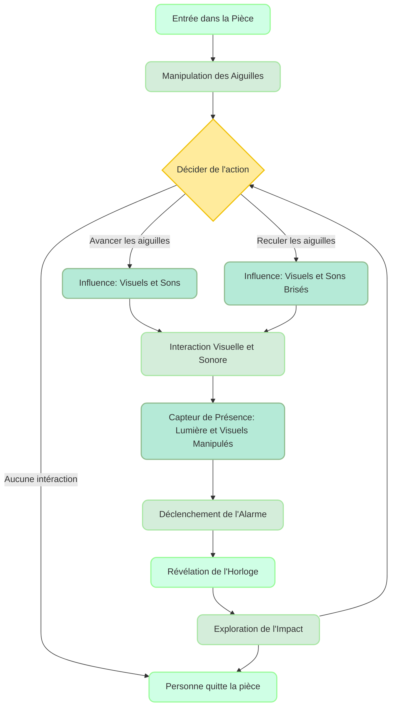

# Scénariser l'intéractivité 
## Idée
### Concept
Une oeuvre intéractive et immersive où l'intéracteur manipule le temps. Il contrôle une horloge qui a un impact direct sur les visuels et les sons, démontrant que chaque action a un impact sur le futur.
### Objectifs
- **Le temps est irréversible** : Illustrer qu'il est impossible de revenir en arrière et que le temps avance de manière irréversible.
- **Impact des actions** : Montrer que chaque action a des conséquences directe, soulignant l'importance de nos choix.
### Motivations
- Nouvelles technologies (capteurs de présence, capteurs d'angle)
- Utilisation d'objets physique
- 
Discussion des motivations créatives derrière le choix des médias et des technologies.
## Scénario
### Interactif

### Narratif
L'interacteur entre dans une pièce, ajuste les aiguilles d'une horloge et découvre que ses actions influencent les visuels et les sons. Une alarme et une lumière sur l'horloge révèlent l'impact de ses choix.

### Expérience utilisateur

- **Entrée dans l'espace** : L’intéracteur entre dans la pièce et découvre l'horloge illuminée.
- **Manipulation des aiguilles** : L’utilisateur ajuste les aiguilles de l'horloge (avance ou recule).
- **Interaction avec l'environnement** : Les visuels et les sons changent en temps réel en réponse aux ajustements des aiguilles.
- **Réaction des capteurs** : Les capteurs détectent la présence de l'utilisateur et modifient la lumière et les visuels en conséquence.
- **Déclenchement de l'alarme** : Après un certain temps, une alarme sonnet et les visuels disparaissent, concentrant la lumière sur l'horloge.
- **Révélation de l'impact** : L'utilisateur observe comment ses ajustements des aiguilles influencent l'œuvre et l'environnement.
- **Exploration des Conséquences** : L'utilisateur continue d'interagir avec l'horloge pour comprendre les effets de ses choix dans l'espace.
   
## Ambiance
### Planche d'ambiances visuelles
Sert à illustrer l'atmosphère visuelle du projet.
Utilisation d’images, de palettes de couleurs, de textures pour représenter l’univers artistique.
### Planche d'ambiances sonores
Sert à illustrer l'atmosphère sonore du projet.
Utilisation d'échantillons, de musiques, de textures sonores pour représenter l’univers artistique.
### Références artistiques
Explication de l’esthétique et du design choisi, et comment ils renforcent la narration.
Choix de références visuelles et sonores (films, œuvres d’art, environnements) qui influencent l’expérience.
## Technologies
### Support médiatique
Description des types de médias (vidéo, audio, lumières, capteurs, etc.) et de leur intégration pour créer une expérience immersive.
### Matériel
Technologies interactives : Liste des technologies interactives employées (caméras, LIDAR, systèmes RFID, etc.) pour capter et analyser les actions du public en temps réel, permettant de déclencher des événements en réponse.

- Lidar
- 
Plateformes et outils : Présentation matériels et interfaces interactives nécessaires au projet, comme des logiciels de projection, des systèmes de tracking ou des capteurs intelligents.
- 

### Logiciels
- Touch designer

Réseautage et communication  :
- **OSC** : Données des capteurs vers les logiciels de projection et des systèmes audio.
- **MIDI** : Synchroniser les effets sonores avec les ajustements des aiguilles de l'horloge.
- **Réseaux** : Réseaux Ethernet ou Wi-Fi.
