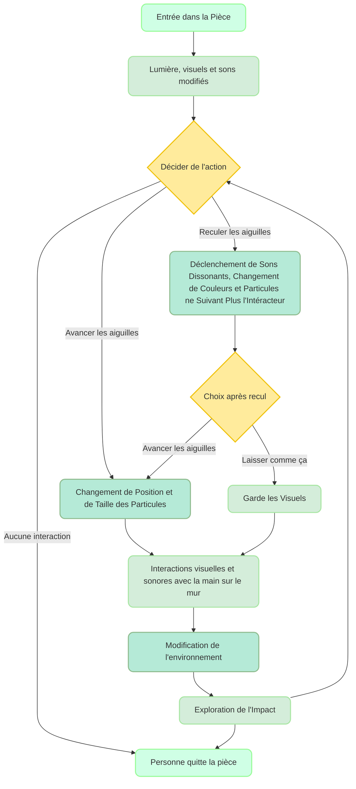

# ChronoSpectra (Spectre du Temps)
### Concept
Une oeuvre intéractive et immersive où l'intéracteur manipule le temps. Il contrôle une horloge qui a un impact direct sur les visuels et les sons, démontrant que chaque action a un impact sur le futur.
### Objectifs
- **Le temps est irréversible** : Illustrer qu'il est impossible de revenir en arrière et que le temps avance de manière irréversible.
- **Impact des actions** : Montrer que chaque action a des conséquences directe, soulignant l'importance de nos choix.
### Motivations
- **Nouvelles technologies** : Intégration de capteurs de présence et de capteurs d'angle pour enrichir l'expérience.
- **Utilisation d'objets physiques** : Utiliser un objet physique et le contrôler.
- **Créativité et expression personnelle** : Créer une oeuvre où chacun peut exprimer
## Scénario
### Interactif

### Narratif
L'interacteur entre dans une tour d'horloge et ajuste les aiguilles, découvrant que ses actions influencent les visuels et les sons. Il se transportant ainsi à travers le temps tout en manipulant les particules qui l'entourent. Chaque geste à un impact direct sur l'environnement.
### Expérience utilisateur
- **Entrée dans l'espace** : L’intéracteur entre dans la pièce et découvre l'horloge illuminée.
- **Manipulation des aiguilles** : L’utilisateur ajuste les aiguilles de l'horloge (avance ou recule).
- **Interaction avec l'environnement** : Les visuels et les sons changent en temps réel en réponse aux ajustements des aiguilles.
- **Réaction des capteurs** : Les capteurs détectent la présence de l'utilisateur et modifient la lumière et les visuels en conséquence.
- **Révélation de l'impact** : L'utilisateur observe comment ses ajustements des aiguilles influencent l'œuvre et l'environnement.
- **Exploration des conséquences** : L'utilisateur continue d'interagir avec l'horloge pour comprendre les effets de ses choix dans l'espace.
- **Choix supplémentaires** : Après avoir reculé les aiguilles, l'utilisateur peut décider de laisser l'état chaotique ou de revenir en avant.
- **Feedback visuel et sonore** : Chaque action à un impact et renforce la connexion entre l'utilisateur et l'œuvre.
- **Exploration libre** : L'utilisateur est encouragé à expérimenter.
   
## Ambiance
### Planche d'ambiances visuelles
L'esthétique steampunk de la tour d'horloge crée un univers immersif, non réaliste. Les particules qui changent à travers les horloges et les actions de l'utilisateur symbolisent le voyage dans le temps.

### Planche d'ambiances sonores
- [État de veille / Aucune intéraction ](https://www.youtube.com/watch?v=JiogkSyZrNE)
- [Mouvement de particules](https://youtu.be/9EX5DCNdgkQ?si=hgGJ3D5o2K2U35Oe&t=72)
- [Musique de fond + ambiance lorsque aiguilles avances](https://youtu.be/FjOsnoqN1TE?si=oeMmLjaEoNIi0cqX&t=4065)
- [Ambiance de fond lorsque recule aiguilles](https://youtu.be/7tKG5vaTLhE?si=Lireml1ShS82FWfJ&t=122)
- [Musique de fond lorsque aiguilles reculent](https://youtu.be/N0pHcH5dYSw?si=5QluCPJhOgtpFpzq&t=2506)

### Références artistiques

## Technologies
### Support médiatique

**Audio** : 
- Musique de fond et sons mécaniques d'horloge. (Effets mystérieux)
- Bruits de particules qui bougent (Mouvement et jouer avec le temps) 
- Bruits dissonants (Lorsqu'on essaie de reculer le temps, montre qu'il est impossible de le faire

**Visuels** :
- Animations d'une tour d'horloge (effet surréel, immersif)
- Animations de particules qui changent selon les mouvements des aiguilles et le mouvement de la main sur le mur (illustre un voyage dans le temps, instabilité/temporalité/fluidité du temps.

**Lumières** : Éclairages dynamiques et changement de couleurs selon la direction des aiguilles.

### Matériel
- **LIDAR** : Détecter la position et les mouvements de l'utilisateur.
- **Projecteurs** : Projeter des visuels et modifier l'environnement en fonction des actions de l'utilisateur.
- **Capteurs de présence** : Détecter la présence d'un utilisateur dans l'environnement.
- **Capteurs d'angle** : Mesurer les mouvements des aiguilles.
- **Systèmes audio** : Créer un environnements sonores immersifs.
- **Ordinateur et ses composants** : Traiter les données des capteurs et gérer les logiciels interactifs.

### Logiciels
- **TouchDesigner** : Créer des visuels interactifs en temps réel et gérer les effets visuels.
- **MadMapper** : Mapping vidéo et projeter les visuels sur les murs.
- **Arduino** : Contrôle des capteurs.
- **OSC Bridge**: Communiquer entre les logiciels et capteurs.

### Réseautage et communication  :
- **OSC** : Données des capteurs vers les logiciels de projection et des systèmes audio.
- **MIDI** : Synchroniser les effets sonores avec les ajustements des aiguilles de l'horloge.
- **Réseaux** : Réseaux Ethernet ou Wi-Fi.
